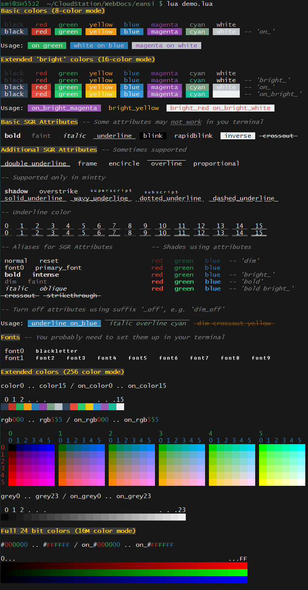

# eansi 1.2 Easy ANSI Color Maker

[](https://mit-license.org) [](https://travis-ci.com/smi11/eansi-lua) [](https://coveralls.io/github/smi11/eansi-lua?branch=main)

Easy, customizable and flexible way to colorize your terminal output. Convert
strings describing ANSI colors to extended ANSI escape sequences. Support for
3,4,8 and 24 bit ANSI escape sequences and thus enabling 8, 16, 256 and 16M
colors, depending on your terminal capabilities.

Module offers color tags, HTML tags, simple palette handling, caching, etc..

See: <https://en.wikipedia.org/wiki/ANSI_escape_code>

## Installation

### Using LuaRocks

Installing `eansi.lua` using [LuaRocks](https://www.luarocks.org/):

`$ luarocks install eansi`

### Without LuaRocks

Download file `eansi.lua` and put it into the directory for Lua libraries or
your working directory.

## Quick start

```lua
local eansi = require "eansi"

local mycolor = eansi.toansi "bold bright_yellow on_rgb020"
print(mycolor .. "some text" .. eansi "") -- eansi "" returns ansi reset string

print(eansi "${bold red}My ${bold_off green}colorful ${italic blue on_grey3}string")
print(eansi.underline.on_magenta "Another line of colored text")
```

## API

### Settings

All settings are set automatically and they also recover automatically. Which means if you accidentally delete any of them, they would re-initialize back to their default value on their first use. So, if you temporarily change for example `eansi._resetcmd` and set it to something else, you could restore its default value by simply saying `eansi._resetcmd = nil`.

First three are type boolean and you can toggle them anytime. For setting starting with `_` is recommended you only set them in the beginning of your program and don't change them later.

|      Setting      |  Default value  |                Description                |
|-------------------|-----------------|-------------------------------------------|
| `eansi.enable`    | _depends on OS_ | Enable ANSI color output.                 |
| `eansi.htmltags`  | `false`         | Enable use of HTML tags.                  |
| `eansi.cache`     | `true`          | Enable caching for function toansi()      |
| `eansi._colortag` | `"$%b{}"`       | Lua string pattern to use for color tags. |
| `eansi._resetcmd` | `"reset font0"` | Command to use to reset SGR attributes.   |
| `eansi._palette`  | `{}`            | Table to store palette entries.           |

#### `eansi.enable`

If disabled `eansi` will not produce any ANSI escape sequences for its output. In other words, all functions will return empty string instead of ANSI escapes. Default is false on Windows, and true for any other OS.

#### `eansi.htmltags`

If enabled you can use HTML tags `<b>`, `<i>`, `<u>`, `<sub>` and `<sup>` to switch corresponding SGR attributes on or off. Note that `<sub>` and `<sup>` are only supported in mintty terminal. This setting is disabled by default as this functionality affects strings containing HTML code.

#### `eansi.cache`

Default is enabled since memory use is almost the same when caching is disabled but speed up is significant in most cases. However you may disable caching if you wish.

#### `eansi._colortag`

Lua string pattern for color tags. `enasi` uses color tags inserted into string to be replaced with corresponding ANSI escapes. For example `eansi` would replace tags `${red}`, `${intense}` and `${intense off}` with escapes in the following string:

    "${red}This is my ${intense}string${intense off} in red color."

If you would like to change leading character of the tag and opening and closing "bracket" you can do that. However `eansi._colortag` must be some leading character followed by `%b()`, `%b[]`, `%b{}`, or `%b<>` or some other matching pair as the offsets of such enclosed substring are hard coded and fixed. Also there is no error checking for validity of pattern and if you changed it to something else it would definitely cause errors.

#### `eansi._resetcmd`

ANSI command to use to reset Select Graphic Rendition (SGR) attributes and colors. `"reset"` alone does not clear fonts therefore we use `"reset font0"` which does most complete reset. Another possible value for this setting might be `"default on_default"` which resets only foreground and background color.

#### `eansi._palette`

Not really a setting, but a storage for custom palette entries. It is not meant to be modified by user. However it allows for a quick-and-dirty way to erase all palette entries by setting it to `nil`. In that case it is also required to immediately erase cache as well by calling Lua's `collectgarbage()` or there may be unforeseen errors.

### Functions

|          Functions           |                       Description                       |
|------------------------------|---------------------------------------------------------|
| `eansi.toansi(string)`       | Convert string describing color to ANSI escape sequence |
| `eansi.palette(name, color)` | Set or clear custom palette entry                       |
| `eansi.rawpaint(...)`        | Convert color and HTML tags to ANSI escape sequences    |
| `eansi.paint(...)`           | Same as rawpaint() but guards for color leaks           |
| `eansi.nopaint(...)`         | Removes both color and HTML tags and any ANSI escapes   |
| `eansi.register(table)`      | Copy eansi functions to table                           |

#### Function `eansi.toansi(string)`

Main function that converts string describing color and attributes to ANSI escape sequence. Colors are specified as a sequence of tokens/keywords separated with whitespace. Keywords or tokens are keys from table sgr and represent various ANSI colors and attributes. See section: [SGR (Select Graphic Rendition) tokens/keywords for colors and attributes](#sgr-select-graphic-rendition-tokenskeywords-for-colors-and-attributes)

We can mix any combination of colors and attributes into a single statement for `eansi.toansi()` and we will get single ANSI escape sequence with all colors and attributes combined. For example to get escape sequence for bold red color we can say:

```lua
esc = eansi.toansi "bold red" -- which sets esc to ANSI escape "\27[1;31m"
```

Most sensible is to choose only one foreground color, one background color and zero or more color attributes. After all, only the last specified foreground and last specified background color will be active. For example:

```lua
esc = eansi.toansi "red green"                  -- two foregrounds - active green
esc = eansi.toansi "red on_green"               -- OK
esc = eansi.toansi "red on_white bold italic"   -- OK
esc = eansi.toansi "underline rgb112 on_color5" -- OK
```

First statement "red green" is actually not wrong, but it doesn't make sense. We would get ANSI escape `"\27[31;32m"` and only the second definition of foreground color would be active. In other words, we would get green output. Red would be ignored.

Function `toansi` will return empty string if `eansi.enable` is false. It will also return empty string if we specify empty string as a parameter. It will raise an error if we specify an invalid color and/or attribute.

```lua
esc = eansi.toansi ""                 -- esc is empty string

eansi.enable = false
esc = eansi.toansi "grey18 on_black"  -- esc is empty string

esc = eansi.toansi "not a color"      -- Error: Invalid token 'not' in color 'not a color'
```

Function `toansi` will also help us by automatically adding `_` after prefixes `on` and `bright` and before suffix `off`. That means we can write bright colors, background colors and attributes off without underscores only separated by whitespace.

```lua
esc = eansi.toansi "   bright   \t red \n on bright    yellow  " -- whitespace OK

-- is converted to:

esc = eansi.toansi "bright_red on_bright_yellow"
```

However it might be more readable writing colors with underscores as individual color and attribute tokens are clearer that way. For example, bellow we made a mistake by placing bold between prefix `on` and color. Error message shows us where `toansi` placed underscores, and that makes it easier to see our mistake.

```lua
esc = eansi.toansi "on bold red" -- Error: Invalid token 'on_bold' in color 'on_bold red'
```

`toansi` also allows us to enter ANSI escapes directly by prefixing them with `=` sign. We can enter several color codes and attributes by separating them with `;`. This might be useful if our terminal supports codes that are not in sgr table, but we would still like to use them.

```lua
esc = eansi.toansi "=1;3" -- This sets bold and italic to on, esc = "\27[1;3m"
```

#### Function `eansi.palette(name, color)`

`eansi.palette` is quite powerful as it allows us to define new colors and aliases and give them semantic meaning and thus making colorizing of our output more compact.

First parameter is name for palette entry. Name should not contain any whitespace and it is recommended to use only ASCII letters. In most cases it will work fine also with other character sets and even UTF8 characters, but in some rare cases there might be some issues when replacing whitespace for underscores using string.gsub. Also the name must not be any token/keyword from table sgr and eansi module (e.g.: `red`, `on_blue`, `toansi`, `paint`, `enabled` are all invalid names).

Second parameter is color string as described in function `toansi`. So basic use would be:

```lua
-- define new color
eansi.palette ("pink", "#FFC0CB")       -- foreground pink
eansi.palette ("on_pink", "on_#FFC0CB") -- background pink

-- define alias
eansi.palette ("bi", "bold italic")
eansi.palette ("bi_off", "bold_off italic_off")

-- give semantic meaning
eansi.palette ("alert", "bright_red on_white")
eansi.palette ("comment", "dim italic")

-- since we already defined pink above, we can use it for new definition
eansi.palette ("keyword", "underline pink")

-- we can also define SGR codes that are not yet defined here if our terminal supports them
eansi.palette ("ideogram_stress_marking", "=64")

-- then we can use those new palette entries as any other token from sgr table
esc = eansi.toansi "bi pink"
esc = eansi.toansi "alert"
```

We can also define dummy or empty entries as a placeholder by specifying empty string for color.

```lua
eansi.palette ("result_color", "")       -- placeholder
esc = eansi.toansi "result_color"        -- esc is empty string
```

We can overwrite palette entries by simply calling `eansi.palette` with already defined name. And we can erase entries by omitting color or setting it to nil.

```lua
eansi.palette ("alert", "bright_red on_white")      -- first definition
eansi.palette ("alert", "bold bright_red on_white") -- overwrite alert

eansi.palette ("alert")                             -- erase alert
-- or 
eansi.palette ("alert", nil)                        -- erase alert

esc = eansi.toansi "alert" -- Error: Invalid token 'alert' in color 'alert'
```

Defining new palette entries is best done during initialization phase of your program as efficiency of this function drops when dealing with many thousands of palette entries.

#### Function `eansi.rawpaint(...)`

`eansi.rawpaint` replaces color tags and HTML tags in list of strings with ANSI escape codes. Color tags are just strings describing colors and attributes (see function `eansi.toansi`) starting with `$` sign and enclosed in curly braces, e.g.: `${bold red}`. If you wish to customize characters used for color tags see setting `eansi._colortag` above.

Note that when inserting colors to your output using `eansi.rawpaint`, you must take care of closing colors and attrubutes by inserting ANSI reset at the end of your string/output.

```lua
eansi.palette ("alert", "bright_red on_white")

print(eansi.rawpaint"First ${green}green${default} and then ${alert}some alert")
print("this line would still be colored bright red on white", eansi "")
-- call to eansi "" returns ANSI reset
```

HTML tags allow for slighty more compact description of attributes for bold, italic, underline, superscript and subscript:

```lua
eansi.htmltags = true -- by default HTML tags are disabled, so we need to enable them

print(eansi.rawpaint"${blue}<b>bold</b>, <i>italic</i>, <u>underline</u> and <sup>superscript</sup> and <sub>subscript</sub>${default}")
```

#### Function `eansi.paint(...)`

`eansi.paint` is identical to `eansi.rawpaint` except that it guards for colors leaks by inserting ANSI reset before and after our string. So our example from above could be simplified.

```lua
eansi.palette ("alert", "bright_red on_white")

print(eansi.paint "First ${green}green${default} and then ${alert}some alert")
print("this line would be normal color and no attributes")
```

##### `__call metamethod`

`eansi.paint` is bound to module's __call metamethod and therefore allows for shorter syntax by omitting method name `paint`.

```lua
eansi.palette ("alert", "bright_red on_white")

print(eansi "First ${green}green${default} and then ${alert}some alert")

-- is same as bellow but more compact

print(eansi.paint "First ${green}green${default} and then ${alert}some alert")
```

If we call eansi with empty string, it will return one ANSI reset.

```lua
print(eansi.rawpaint "${red}not green", eansi "") -- ansi reset
--> "\27[31mnot green\t\27[0;10m"
```

##### `__index metamethod`

Color and HTML tags are nice, but the downside is that we mix color descriptions with content. We can separate colors from content by appending colors and attributes as methods to our call to `eansi`. Example:

```lua
eansi.palette ("alert", "bright_red on_white")
eansi.htmltags = true

print(eansi.red "This line is written in red color.")  -- simple color
print(eansi.alert "This is ALERT.")                    -- palette entry
print(eansi.bold.green.on_bright_white "We can still <i>use tags</i>") -- mix
print(eansi["#CCAA22 on grey11"] "and even set true 24-bit color") -- using #
```

This way we can still add color tags and HTML tags to insert additional colors into our output.

#### Function `eansi.nopaint(...)`

`eansi.nopaint` strips color tags, HTML tags (only when `eansi.htmltags == true`) and any ANSI escapes from string. This can be useful if we need to count length of our output or simply remove any color information.

```lua
mycolorstring = eansi.bold.green.on_bright_white "some ${bold}string"
-- mycolorstring = "\27[0;10m\27[1;32;107msome \27[1mstring\27[0;10m"

print(eansi.nopaint(mycolorstring))
--> some string
print(#mycolorstring, #eansi.nopaint(mycolorstring))
--> 40    11
```

#### Function `eansi.register(table)`

`eansi.register` will insert functions `toansi`, `rawpaint`, `paint` and `nopaint` into specified library or into string library if table is not provided. This allows for using those functions with colon syntax.

```lua
eansi.register() -- add methods to string library
mystring = "some ${red}red${default} word"

print(mystring:paint(), #mystring:nopaint())
--> some red word 13   (word red is in red color)
```

### SGR (Select Graphic Rendition) tokens/keywords for colors and attributes

```lua
-- 8/16 basic color set
local sgr = {

  -- basic attributes
  reset = 0, normal = 0,
  bold = 1, intense = 1,            bold_off = 22, intense_off = 22,
  faint = 2, dim = 2,               faint_off = 22, dim_off = 22,
  italic = 3, oblique = 3,          italic_off = 23, oblique_off = 23, 
  underline = 4,                    underline_off = 24,
  blink = 5, slowblink = 5,         blink_off = 25, slowblink_off = 25,
  rapidblink = 6,                   rapidblink_off = 25,
  inverse = 7,                      inverse_off = 27,
  conceal = 8, hide = 8,            reveal = 28, hide_off = 28,
  crossout = 9, strikethrough = 9,  crossout_off = 29, strikethrough_off = 29,

  -- fonts
  font0 = 10, primary_font = 10,
  font1 = 11, font2 = 12, font3 = 13, font4 = 14, font5 = 15,
  font6 = 16, font7 = 17, font8 = 18, font9 = 19,
  fraktur = 20, blackletter = 20, fraktur_off = 23, blackletter_off = 23,

  -- additional attributes
  double_underline = 21,    double_underline_off = 24,
  proportional = 26,        proportional_off = 50,

  -- basic foreground colors
  black = 30,
  red = 31,
  green = 32,
  yellow = 33, brown = 33,
  blue = 34,
  magenta = 35,
  cyan = 36,
  white = 37,
  default = 39, -- set foreground color to default

  -- basic background colors
  on_black = 40,
  on_red = 41,
  on_green = 42,
  on_yellow = 43, on_brown = 43,
  on_blue = 44,
  on_magenta = 45,
  on_cyan = 46,
  on_white = 47,
  on_default = 49, -- set background color to default

  -- additional less supported attributes
  frame = 51,       frame_off = 54,
  encircle = 52,    encircle_off = 54,
  overline = 53,    overline_off = 55,
  default_ulcolor = 59, -- set underline color to default

  -- ideogram attributes 60 to 65 are rarely supported and are not defined here

  -- implemented only in mintty
  -- https://github.com/mintty/mintty/wiki/Tips#text-attributes-and-rendering
  shadow = "1:2",               shadow_off = 22,
  solid_underline = "4:1",      solid_underline_off = 24,
  wavy_underline = "4:3",       wavy_underline_off = 24,
  dotted_underline = "4:4",     dotted_underline_off = 24,
  dashed_underline = "4:5",     dashed_underline_off = 24,
  overstrike = "8:7",           overstrike_off = 28,
  superscript = 73, sup = 73,   superscript_off = 75, sup_off = 75,
  subscript = 74, sub = 74,     subscript_off = 75, sub_off = 75,

  -- bright foreground colors
  bright_black = 90,
  bright_red = 91,
  bright_green = 92,
  bright_yellow = 93,
  bright_blue = 94,
  bright_magenta = 95,
  bright_cyan = 96,
  bright_white = 97,

  -- bright background colors
  on_bright_black = 100,
  on_bright_red = 101,
  on_bright_green = 102,
  on_bright_yellow = 103,
  on_bright_blue = 104,
  on_bright_magenta = 105,
  on_bright_cyan = 106,
  on_bright_white = 107,

  -- internal use - prevent prefixes and suffixes as palette entries
  on = false, bright = false, off = false
}

--[[

In addition to the above, there are following extended color tokens/keywords in sgr table:

color0, ..., color15             Selection of 16 foreground colors
on_color0, ..., on_color15       Selection of 16 background colors

rgb000, ..., rgb555              6x6x6 foreground color cube
on_rgb000, ..., on_rgb555        6x6x6 background color cube
color16, ..., color231           Alias for 6x6x6 color cube

grey0, ..., grey23               Shades of foreground greys
on_grey0, ..., on_grey23         Shades of background greys
color232, ..., color255          Alias for shades of grey

ulcolor0, ..., ulcolor15         Selection of 16 colors for underline
ulrgb000, ..., ulrgb555          6x6x6 color cube for underline color
ulcolor16, ..., ulcolor231       Alias for 6x6x6 underline color cube
ulgrey0, ..., ulgrey23           Shades of grey for underline
ulcolor232, ..., ulcolor255      Alias for shades of underline grey

#000000, ..., #FFFFFF            Foreground RGB 24-bit color in hexadecimal
on_#000000, ..., on_#FFFFFF      Background RGB 24-bit color in hexadecimal

--]]
```

## Demo

To see showcase of all supported ANSI colors and attributes run:

```
$ cd /path/to/eansi/
$ lua demo.lua
```



Note that probably some attributes and color modes will not work in your terminal.

## Tests

Running test specs is done using Olivine-Labs [busted](http://olivinelabs.com/busted/). You can install it using [LuaRocks](http://www.luarocks.org/):

```
$ luarocks install busted
$ cd /path/to/eansi/
$ busted
```

## Performance

A small speed test program is also included. Run:

```
$ cd /path/to/eansi/
$ lua test.lua
```

On my low-end (Intel Atom x5-E8000 @ 4x 2GHz, 4GB RAM) laptop and with Lua 5.4 the results were:

```
eansi 1.1 speed test

toansi 1 token    100000        calls in 1.450 seconds, 218.0 KB RAM
toansi 1 token    100000 cached calls in 0.069 seconds, 218.0 KB RAM
toansi 5 tokens   100000        calls in 4.778 seconds, 249.2 KB RAM
toansi 5 tokens   100000 cached calls in 0.073 seconds, 218.6 KB RAM
__index 1 token   100000        calls in 3.337 seconds, 249.3 KB RAM
__index 1 token   100000 cached calls in 0.773 seconds, 255.1 KB RAM
__index 5 tokens  100000        calls in 6.105 seconds, 224.3 KB RAM
__index 5 tokens  100000 cached calls in 1.307 seconds, 250.8 KB RAM
__call 1 token    100000        calls in 3.081 seconds, 252.4 KB RAM
__call 1 token    100000 cached calls in 0.553 seconds, 259.5 KB RAM
__call 5 tokens   100000        calls in 6.503 seconds, 240.8 KB RAM
__call 5 tokens   100000 cached calls in 0.881 seconds, 252.4 KB RAM
paint 1 token     100000        calls in 2.940 seconds, 252.4 KB RAM
paint 1 token     100000 cached calls in 0.497 seconds, 259.5 KB RAM
paint 5 tokens    100000        calls in 6.561 seconds, 228.3 KB RAM
paint 5 tokens    100000 cached calls in 0.880 seconds, 252.5 KB RAM
rawpaint 1 token  100000        calls in 1.254 seconds, 249.7 KB RAM
rawpaint 1 token  100000 cached calls in 0.348 seconds, 252.7 KB RAM
rawpaint 5 tokens 100000        calls in 4.882 seconds, 225.7 KB RAM
rawpaint 5 tokens 100000 cached calls in 0.700 seconds, 233.4 KB RAM
nopaint 1 token   100000        calls in 0.262 seconds, 217.5 KB RAM
nopaint 1 token   100000 cached calls in 0.263 seconds, 217.5 KB RAM
nopaint 5 tokens  100000        calls in 0.300 seconds, 217.5 KB RAM
nopaint 5 tokens  100000 cached calls in 0.301 seconds, 217.5 KB RAM
palette 1 token   100000        calls in 1.955 seconds, 255.8 KB RAM
palette 1 token   100000 cached calls in 0.631 seconds, 252.6 KB RAM
palette 5 tokens  100000        calls in 5.540 seconds, 219.8 KB RAM
palette 5 tokens  100000 cached calls in 0.902 seconds, 244.0 KB RAM
```

Results with LuaJIT 2.1 on the same low-end laptop.

```
eansi 1.1 speed test

toansi 1 token    100000        calls in 0.507 seconds, 385.3 KB RAM
toansi 1 token    100000 cached calls in 0.000 seconds, 182.0 KB RAM
toansi 5 tokens   100000        calls in 1.980 seconds, 276.1 KB RAM
toansi 5 tokens   100000 cached calls in 0.000 seconds, 189.0 KB RAM
__index 1 token   100000        calls in 1.305 seconds, 246.8 KB RAM
__index 1 token   100000 cached calls in 0.363 seconds, 287.2 KB RAM
__index 5 tokens  100000        calls in 2.708 seconds, 281.6 KB RAM
__index 5 tokens  100000 cached calls in 0.593 seconds, 420.4 KB RAM
__call 1 token    100000        calls in 1.256 seconds, 366.0 KB RAM
__call 1 token    100000 cached calls in 0.220 seconds, 319.0 KB RAM
__call 5 tokens   100000        calls in 2.532 seconds, 261.7 KB RAM
__call 5 tokens   100000 cached calls in 0.358 seconds, 311.0 KB RAM
paint 1 token     100000        calls in 1.168 seconds, 337.4 KB RAM
paint 1 token     100000 cached calls in 0.200 seconds, 303.6 KB RAM
paint 5 tokens    100000        calls in 2.500 seconds, 381.8 KB RAM
paint 5 tokens    100000 cached calls in 0.308 seconds, 295.1 KB RAM
rawpaint 1 token  100000        calls in 0.521 seconds, 421.0 KB RAM
rawpaint 1 token  100000 cached calls in 0.168 seconds, 303.1 KB RAM
rawpaint 5 tokens 100000        calls in 1.859 seconds, 293.5 KB RAM
rawpaint 5 tokens 100000 cached calls in 0.282 seconds, 297.0 KB RAM
nopaint 1 token   100000        calls in 0.186 seconds, 206.7 KB RAM
nopaint 1 token   100000 cached calls in 0.172 seconds, 206.7 KB RAM
nopaint 5 tokens  100000        calls in 0.200 seconds, 207.8 KB RAM
nopaint 5 tokens  100000 cached calls in 0.216 seconds, 207.8 KB RAM
palette 1 token   100000        calls in 0.717 seconds, 332.8 KB RAM
palette 1 token   100000 cached calls in 0.159 seconds, 210.7 KB RAM
palette 5 tokens  100000        calls in 2.307 seconds, 467.1 KB RAM
palette 5 tokens  100000 cached calls in 0.259 seconds, 216.6 KB RAM
```

Notice that memory use with caching enabled is virtually the same as when caching is disabled. However performance gain is significant.

## Contributions

Improvements, suggestions and fixes are welcome.

## Changelog

### 1.2

- replaced parameter str for rawpaint, paint, nopaint and __call method for ...
 
### 1.1

- renamed from colors to eansi
- changed monkey patch for _G.strings so it is now optional
- added settings for caching, color tags, HTML tags
- added simple palette
- added ansi codes for mintty
- added ansi codes for underline color
- refactor code
- added documentation README.md
- added busted tests
- changes to demo.lua
- first public release

### 1.0

- first draft

## License

The code is released under the MIT terms. Feel free to use it in both open and
closed software as you please.

MIT License
Copyright (c) 2020-2021 Milan Slunečko

Permission is hereby granted, free of charge, to any person obtaining a copy
of this software and associated documentation files (the "Software"), to deal
in the Software without restriction, including without imitation the rights
to use, copy, modify, merge, publish, distribute, sublicense, and/or sell
copies of the Software, and to permit persons to whom the Software is
furnished to do so, subject to the following conditions:

The above copyright notice and this permission notice shall be included in all
copies or substantial portions of the Software.

THE SOFTWARE IS PROVIDED "AS IS", WITHOUT WARRANTY OF ANY KIND, EXPRESS OR
IMPLIED, INCLUDING BUT NOT LIMITED TO THE WARRANTIES OF MERCHANTABILITY,
FITNESS FOR A PARTICULAR PURPOSE AND NONINFRINGEMENT. IN NO EVENT SHALL THE
AUTHORS OR COPYRIGHT HOLDERS BE LIABLE FOR ANY CLAIM, DAMAGES OR OTHER
LIABILITY, WHETHER IN AN ACTION OF CONTRACT, TORT OR OTHERWISE, ARISING FROM,
OUT OF OR IN CONNECTION WITH THE SOFTWARE OR THE USE OR OTHER DEALINGS IN THE
SOFTWARE.

Except as contained in this notice, the name(s) of the above copyright holders
shall not be used in advertising or otherwise to promote the sale, use or other
dealings in this Software without prior written authorization.
